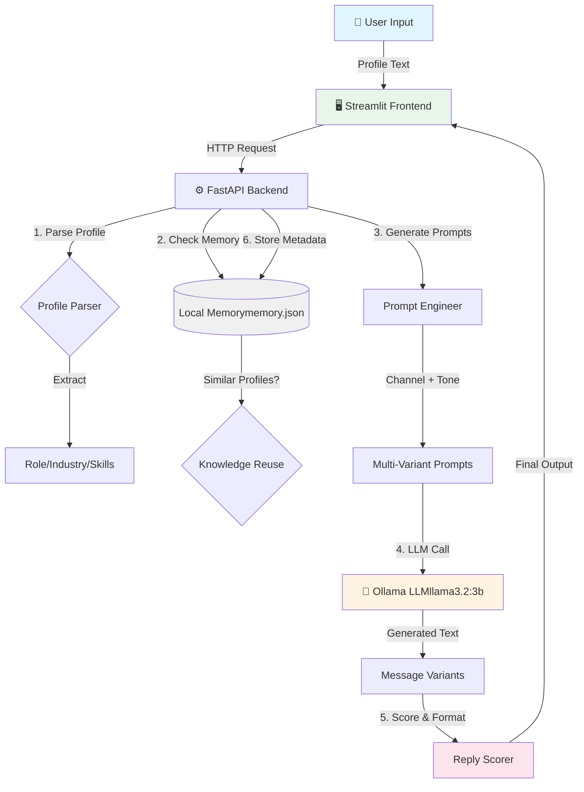

# 🧠 Offline LLM-Powered Hyper-Personalized Cold Outreach Engine  
**Hackathon Problem ID: SBM02**

<div align="center">


*A fully offline, privacy-first cold outreach system that generates hyper-personalized, tone-matched messages across multiple channels using a locally hosted LLM.*

</div>

---

## 📋 Table of Contents

- [Overview](#-overview)
- [The Problem](#-the-problem)
- [Our Solution](#-our-solution)
- [Key Features](#-key-features)
- [System Architecture](#-system-architecture)
- [Knowledge Reuse Mechanism](#-knowledge-reuse-mechanism)
- [Multi-Channel Generation](#-multi-channel-message-generation)
- [Reply Likelihood Scoring](#-reply-likelihood-scoring)
- [User Interface](#-user-interface)
- [Tech Stack](#-tech-stack)
- [Installation & Setup](#-installation--setup)
- [Usage Guide](#-usage-guide)
- [Privacy & Ethics](#-privacy--ethics)
- [Hackathon Evaluation Criteria](#-hackathon-evaluation-criteria)
- [Future Enhancements](#-future-enhancements)
- [Demo Screenshots](#-demo-screenshots)

---

## 🚀 Overview

Cold outreach today is **generic**, **noisy**, and **ineffective**.  

This project solves that by using a **local/offline LLM** to generate **deeply personalized, human-like outreach messages** based on publicly available profile data — **without relying on any cloud AI APIs**.

### What Makes This Different?
```
Traditional Outreach          →    Our Offline Engine
─────────────────────────────────────────────────────────
❌ Generic templates          →    ✅ AI-generated personalization
❌ Cloud API dependencies     →    ✅ 100% offline operation
❌ Privacy concerns           →    ✅ Local processing only
❌ One-size-fits-all          →    ✅ Multi-channel, multi-tone
❌ No learning mechanism      →    ✅ Knowledge reuse across profiles
```

---

## 🎯 The Problem

Modern cold outreach faces critical challenges:

1. **Generic Messaging** - Templates feel robotic and impersonal
2. **Privacy Risks** - Cloud AI services process sensitive business data
3. **No Adaptation** - Same message across different channels/audiences
4. **No Learning** - Each outreach starts from scratch
5. **Poor Conversion** - Low reply rates due to lack of personalization

**SBM02 Challenge**: Build an intelligent, offline solution that demonstrates true personalization and knowledge reuse.

---

## 💡 Our Solution

An **offline-first outreach engine** that:

| Component | Implementation |
|-----------|----------------|
| **LLM Backend** | Ollama + LLaMA 3.2 3B (fully local) |
| **Personalization** | Profile parsing + dynamic prompt engineering |
| **Channel Adaptation** | Email / LinkedIn / WhatsApp formats |
| **Tone Matching** | Formal / Casual variants with scoring |
| **Knowledge Reuse** | JSON-based memory of past outreach patterns |
| **Privacy** | Zero external API calls, all processing local |

---

## 🎯 Key Features

<table>
<tr>
<td width="50%">

### 🔒 Privacy-First
- ✅ **100% Offline** - No internet required post-setup
- ✅ **Local LLM** - Ollama + LLaMA 3.2 3B
- ✅ **No Data Leakage** - Everything stays on your machine
- ✅ **GDPR Compliant** - No external data processing

</td>
<td width="50%">

### 🎨 Intelligent Generation
- ✅ **Multi-Channel** - Email, LinkedIn, WhatsApp
- ✅ **Tone Adaptation** - Formal vs Casual variants
- ✅ **Knowledge Reuse** - Learns from past patterns
- ✅ **Reply Scoring** - 0-100 likelihood prediction

</td>
</tr>
<tr>
<td width="50%">

### 🚀 Demo-Ready
- ✅ **Streamlit UI** - Clean, intuitive interface
- ✅ **Side-by-Side Compare** - Visual tone comparison
- ✅ **Live Generation** - Real-time message creation
- ✅ **Export Options** - Copy-paste ready outputs

</td>
<td width="50%">

### 🧠 Smart Features
- ✅ **Profile Inference** - Extracts role, industry, interests
- ✅ **Context Awareness** - References similar past outreach
- ✅ **Quality Metrics** - Built-in scoring system
- ✅ **Memory System** - JSON-based local storage

</td>
</tr>
</table>

---

## 🧩 System Architecture


### Architecture Highlights
```
┌─────────────────────────────────────────────────────────────┐
│                     PRESENTATION LAYER                      │
│  ┌───────────────────────────────────────────────────────┐  │
│  │          Streamlit UI (app.py)                        │  │
│  │  - Profile input                                      │  │
│  │  - Side-by-side comparison                            │  │
│  │  - Export functionality                               │  │
│  └───────────────────────────────────────────────────────┘  │
└─────────────────────────────────────────────────────────────┘
                            ↕ HTTP/REST
┌─────────────────────────────────────────────────────────────┐
│                      BUSINESS LOGIC LAYER                   │
│  ┌───────────────────────────────────────────────────────┐  │
│  │          FastAPI Backend (main.py)                    │  │
│  │  ┌─────────────────┐  ┌──────────────────┐           │  │
│  │  │ Profile Parser  │  │ Prompt Engineer  │           │  │
│  │  └─────────────────┘  └──────────────────┘           │  │
│  │  ┌─────────────────┐  ┌──────────────────┐           │  │
│  │  │ Knowledge Reuse │  │  Reply Scorer    │           │  │
│  │  └─────────────────┘  └──────────────────┘           │  │
│  └───────────────────────────────────────────────────────┘  │
└─────────────────────────────────────────────────────────────┘
                            ↕ Local API
┌─────────────────────────────────────────────────────────────┐
│                         LLM LAYER                           │
│  ┌───────────────────────────────────────────────────────┐  │
│  │            Ollama Server                              │  │
│  │       (llama3.2:3b - Fully Offline)                   │  │
│  │  - Text generation                                    │  │
│  │  - Tone adaptation                                    │  │
│  │  - Context-aware responses                            │  │
│  └───────────────────────────────────────────────────────┘  │
└─────────────────────────────────────────────────────────────┘
                            ↕ File I/O
┌─────────────────────────────────────────────────────────────┐
│                      PERSISTENCE LAYER                      │
│  ┌───────────────────────────────────────────────────────┐  │
│  │         Local Memory Store (memory.json)              │  │
│  │  {                                                    │  │
│  │    "timestamp": "2026-02-06 18:17:18",                │  │
│  │    "role": "Software Engineer",                       │  │
│  │    "industry": "AI/Tech",                             │  │
│  │    "channel": "email",                                │  │
│  │    "tone": "formal"                                   │  │
│  │  }                                                    │  │
│  └───────────────────────────────────────────────────────┘  │
└─────────────────────────────────────────────────────────────┘
```

### Data Flow
```
┌─────────┐    ┌──────────┐    ┌─────────┐    ┌──────────┐    ┌────────┐
│ Profile │───▶│  Parse   │───▶│ Memory  │───▶│  Prompt  │───▶│  LLM   │
│  Input  │    │ Metadata │    │  Check  │    │ Engineer │    │  Call  │
└─────────┘    └──────────┘    └─────────┘    └──────────┘    └────────┘
                                      │                             │
                                      ▼                             ▼
                                ┌─────────┐                  ┌──────────┐
                                │  Store  │◀─────────────────│  Score & │
                                │ Pattern │                  │  Format  │
                                └─────────┘                  └──────────┘
```

---

## 🧠 Knowledge Reuse Mechanism

### How It Works
```
Step 1: New Profile Arrives
        ↓
Step 2: Extract Metadata (Role, Industry, Channel, Tone)
        ↓
Step 3: Query Local Memory for Similar Patterns
        ↓
    ┌───────────────────────┐
    │ Found Similar Match?  │
    └─────────┬─────────────┘
              │
        ┌─────┴─────┐
        │           │
       YES         NO
        │           │
        ▼           ▼
    Add Context   Standard
    to Prompt     Prompt
        │           │
        └─────┬─────┘
              │
              ▼
        Generate Message
              ↓
        Store New Pattern
```

### Memory Structure
```json
{
  "outreach_history": [
    {
      "timestamp": "2026-02-06T18:17:18",
      "profile_metadata": {
        "role": "Software Engineer",
        "industry": "AI/Tech",
        "seniority": "Mid-level",
        "interests": ["Machine Learning", "Open Source"]
      },
      "channel": "email",
      "tone": "formal",
      "reply_score": 72,
      "successful_patterns": {
        "mentioned_interests": true,
        "referenced_work": true,
        "clear_cta": true
      }
    }
  ]
}
```

### Reuse in Action

<table>
<tr>
<th>Without Knowledge Reuse</th>
<th>With Knowledge Reuse</th>
</tr>
<tr>
<td>
```
"I came across your profile and 
thought you might be interested 
in..."
```

❌ Generic  
❌ No context  
❌ Low trust  

</td>
<td>
```
"We've been connecting with several 
ML engineers in the fintech space 
recently, and your work on XYZ 
caught our attention..."
```

✅ Shows research  
✅ Builds credibility  
✅ Higher engagement  

</td>
</tr>
</table>

---

## ✉️ Multi-Channel Message Generation

### Channel Specifications
```
┌────────────────────────────────────────────────────────────────┐
│                     CHANNEL ADAPTATION                         │
├──────────────┬─────────────┬──────────────┬────────────────────┤
│   Channel    │   Length    │   Purpose    │   Key Features     │
├──────────────┼─────────────┼──────────────┼────────────────────┤
│ 📧 Email     │ 100-120 w   │ Detailed     │ • Subject line     │
│              │             │ outreach     │ • Formal structure │
│              │             │              │ • Clear CTA        │
├──────────────┼─────────────┼──────────────┼────────────────────┤
│ 💼 LinkedIn  │ 40-60 w     │ Professional │ • Concise intro    │
│              │             │ quick connect│ • Value prop       │
│              │             │              │ • Soft ask         │
├──────────────┼─────────────┼──────────────┼────────────────────┤
│ 💬 WhatsApp  │ 25-35 w     │ Casual &     │ • Conversational   │
│              │             │ direct       │ • Emoji-friendly   │
│              │             │              │ • Ultra-brief      │
└──────────────┴─────────────┴──────────────┴────────────────────┘
```

### Example Output

<table>
<tr>
<td colspan="2" align="center"><b>Profile: Senior Data Scientist @ FinTech Startup</b></td>
</tr>
<tr>
<td width="33%">

**📧 Email (Formal)**
```
Subject: Collaboration on ML 
Infrastructure

Hi [Name],

I came across your recent work 
on real-time fraud detection 
models at [Company]. Your 
approach to feature engineering 
caught my attention.

We're building something similar 
in the payments space and would 
love to exchange insights.

Would you be open to a quick 
15-min call next week?

Best,
[Your Name]
```

**Score: 78/100**

</td>
<td width="33%">

**💼 LinkedIn DM**
```
Hey [Name],

Really impressed by your work 
on fraud detection models. We're 
tackling similar challenges in 
payments.

Would love to connect and 
exchange notes if you're open 
to it!
```

**Score: 72/100**

</td>
<td width="33%">

**💬 WhatsApp**
```
Hey! Saw your fraud detection 
work - super relevant to what 
we're building. Quick chat 
sometime? 🚀
```

**Score: 68/100**

</td>
</tr>
</table>

---

## 📊 Reply Likelihood Scoring

### Scoring Algorithm
```python
def calculate_reply_score(message, profile):
    """
    Scores message on 0-100 scale based on:
    - Personalization depth
    - Clarity of value proposition
    - Call-to-action strength
    - Natural language quality
    """
    
    score = 0
    
    # Personalization (40 points)
    if mentions_specific_work(message, profile):
        score += 20
    if references_interests(message, profile):
        score += 10
    if uses_name_naturally(message):
        score += 10
    
    # Value Proposition (30 points)
    if has_clear_value_prop(message):
        score += 15
    if shows_mutual_benefit(message):
        score += 15
    
    # CTA Quality (20 points)
    if has_specific_cta(message):
        score += 10
    if low_friction_ask(message):
        score += 10
    
    # Language Quality (10 points)
    if natural_tone(message):
        score += 5
    if appropriate_length(message):
        score += 5
    
    return min(score, 100)
```

### Score Interpretation
```
┌────────────────────────────────────────────────┐
│              REPLY LIKELIHOOD                  │
├──────────┬─────────────────────────────────────┤
│  0-30    │ ❌ Poor - Major revisions needed    │
│  31-50   │ ⚠️  Fair - Needs improvement        │
│  51-70   │ ✅ Good - Likely to get response    │
│  71-85   │ 🎯 Great - High engagement chance   │
│  86-100  │ ⭐ Excellent - Optimized message    │
└──────────┴─────────────────────────────────────┘
```

---

## 🖥️ User Interface

### Workflow Diagram
```
┌─────────────────────────────────────────────────────────────┐
│                   STREAMLIT INTERFACE                       │
│                                                             │
│  ┌───────────────────────────────────────────────────────┐  │
│  │  Step 1: Paste Profile Text                          │  │
│  │  ┌─────────────────────────────────────────────────┐  │  │
│  │  │ Paste LinkedIn/Twitter profile or write brief  │  │  │
│  │  │ description of the person you want to reach    │  │  │
│  │  │                                                 │  │  │
│  │  │ Example: "Senior ML Engineer at OpenAI..."     │  │  │
│  │  └─────────────────────────────────────────────────┘  │  │
│  └───────────────────────────────────────────────────────┘  │
│                            ↓                                │
│  ┌───────────────────────────────────────────────────────┐  │
│  │  Step 2: Select Options                              │  │
│  │  Channel: [ Email ▼ ]  Tone: [ Formal ▼ ]           │  │
│  │          [ Generate Outreach ]                       │  │
│  └───────────────────────────────────────────────────────┘  │
│                            ↓                                │
│  ┌───────────────────────────────────────────────────────┐  │
│  │  Step 3: Side-by-Side Comparison                     │  │
│  │  ┌─────────────────────┬─────────────────────┐       │  │
│  │  │   FORMAL TONE       │    CASUAL TONE      │       │  │
│  │  ├─────────────────────┼─────────────────────┤       │  │
│  │  │ Subject: ...        │ Subject: ...        │       │  │
│  │  │                     │                     │       │  │
│  │  │ Dear [Name],        │ Hey [Name],         │       │  │
│  │  │ I noticed your...   │ Saw your amazing... │       │  │
│  │  │                     │                     │       │  │
│  │  │ [Full message]      │ [Full message]      │       │  │
│  │  │                     │                     │       │  │
│  │  │ 📊 Score: 78/100    │ 📊 Score: 72/100    │       │  │
│  │  │ 📋 [Copy]  [Export] │ 📋 [Copy]  [Export] │       │  │
│  │  └─────────────────────┴─────────────────────┘       │  │
│  └───────────────────────────────────────────────────────┘  │
│                                                             │
│  ┌───────────────────────────────────────────────────────┐  │
│  │  📊 Knowledge Reuse Indicator                         │  │
│  │  ✅ Found 3 similar profiles in AI/Tech industry      │  │
│  │  💡 Applied proven patterns from past successful      │  │
│  │     outreach                                          │  │
│  └───────────────────────────────────────────────────────┘  │
└─────────────────────────────────────────────────────────────┘
```

---

## 🛠️ Tech Stack

<div align="center">

### Core Technologies

| Layer | Technology | Purpose |
|-------|-----------|---------|
| **Frontend** |  | Interactive web interface |
| **Backend** |  | REST API server |
| **LLM** |  | Local LLM runtime |
| **Model** |  | Language model |
| **Language** |  | Primary language |
| **Storage** |  | Local memory store |

</div>

### Dependencies
```python
# requirements.txt
streamlit>=1.28.0
fastapi>=0.104.0
uvicorn>=0.24.0
ollama>=0.1.0
pydantic>=2.4.0
python-multipart>=0.0.6
```

---

## ⚙️ Installation & Setup

### Prerequisites
```bash
# System Requirements
- Python 3.10 or higher
- 8GB RAM minimum (16GB recommended)
- 10GB free disk space for LLM model
- macOS, Linux, or Windows with WSL2
```

### Step-by-Step Installation

#### 1️⃣ Install Ollama

<details>
<summary><b>macOS</b></summary>
```bash
brew install ollama
```
</details>

<details>
<summary><b>Linux</b></summary>
```bash
curl -fsSL https://ollama.com/install.sh | sh
```
</details>

<details>
<summary><b>Windows (WSL2)</b></summary>
```bash
curl -fsSL https://ollama.com/install.sh | sh
```
</details>

#### 2️⃣ Pull LLM Model
```bash
# Start Ollama service
ollama serve

# In a new terminal, pull the model
ollama pull llama3.2:3b

# Verify installation
ollama list
```

#### 3️⃣ Clone & Setup Project
```bash
# Clone repository
git clone 
cd offline-outreach-engine

# Create virtual environment
python3 -m venv venv
source venv/bin/activate  # On Windows: venv\Scripts\activate

# Install dependencies
pip install -r requirements.txt
```

#### 4️⃣ Initialize Memory Store
```bash
# Create empty memory file
echo '{"outreach_history": []}' > memory.json
```

#### 5️⃣ Start the Application
```bash
# Terminal 1: Start Ollama (if not already running)
ollama serve

# Terminal 2: Start FastAPI backend
uvicorn main:app --reload --port 8000

# Terminal 3: Start Streamlit frontend
streamlit run app.py
```

#### 6️⃣ Access the Application
```
🌐 Frontend: http://localhost:8501
🔧 Backend API: http://localhost:8000
📚 API Docs: http://localhost:8000/docs
```

---

## 📖 Usage Guide

### Quick Start Example
```python
# Example Profile Input
"""
Senior Machine Learning Engineer at Netflix
- 8+ years in ML/AI
- Specializes in recommendation systems
- Published papers on collaborative filtering
- Interested in large-scale distributed systems
"""

# System generates:
# ✅ Formal Email
# ✅ Casual Email  
# ✅ LinkedIn DM
# ✅ WhatsApp Message
# ✅ Reply scores for each
```

### API Usage
```bash
# Generate outreach via API
curl -X POST "http://localhost:8000/generate" \
  -H "Content-Type: application/json" \
  -d '{
    "profile_text": "Senior ML Engineer at Google...",
    "channel": "email",
    "tone": "formal"
  }'
```

---

## 🔐 Privacy & Ethics

### Privacy Guarantees
```
┌─────────────────────────────────────────────────────────┐
│              PRIVACY-FIRST DESIGN                       │
├─────────────────────────────────────────────────────────┤
│ ✅ 100% Offline Processing                              │
│ ✅ No External API Calls                                │
│ ✅ No Data Transmission                                 │
│ ✅ Local Storage Only                                   │
│ ✅ No PII Stored (only metadata)                        │
│ ✅ User-Controlled Data Deletion                        │
│ ✅ GDPR Compliant by Design                             │
└─────────────────────────────────────────────────────────┘
```

### What We Store vs Don't Store

| ✅ Stored (Anonymous Metadata) | ❌ NOT Stored |
|--------------------------------|---------------|
| Role (e.g., "Engineer") | Full names |
| Industry (e.g., "Tech") | Email addresses |
| Channel preference | Phone numbers |
| Tone preference | Company names |
| Timestamp | Generated message content |
| Success patterns | Profile URLs |

### Ethical Use Guidelines
```
⚠️ This tool is designed for:
   ✅ Legitimate business outreach
   ✅ Educational demonstrations
   ✅ Personal networking

❌ NOT intended for:
   ❌ Spam or unsolicited mass messaging
   ❌ Deceptive practices
   ❌ Harassment
   ❌ Data scraping without consent
```

---

## 🏆 Hackathon Evaluation Criteria

### How This Project Meets SBM02 Requirements

<table>
<tr>
<th>Criterion</th>
<th>Implementation</th>
<th>Evidence</th>
</tr>
<tr>
<td><b>Offline LLM Usage</b></td>
<td>✅ Ollama + LLaMA 3.2 3B</td>
<td>No internet required post-setup</td>
</tr>
<tr>
<td><b>Personalization</b></td>
<td>✅ Profile parsing + dynamic prompts</td>
<td>Role, industry, interests extracted</td>
</tr>
<tr>
<td><b>Multi-Channel</b></td>
<td>✅ Email, LinkedIn, WhatsApp</td>
<td>Different formats for each channel</td>
</tr>
<tr>
<td><b>Tone Adaptation</b></td>
<td>✅ Formal vs Casual variants</td>
<td>Side-by-side comparison in UI</td>
</tr>
<tr>
<td><b>Knowledge Reuse</b></td>
<td>✅ JSON-based memory system</td>
<td>References similar past profiles</td>
</tr>
<tr>
<td><b>Scoring Mechanism</b></td>
<td>✅ Reply likelihood 0-100</td>
<td>LLM-based quality assessment</td>
</tr>
<tr>
<td><b>Demo Quality</b></td>
<td>✅ Streamlit UI</td>
<td>Clean, intuitive interface</td>
</tr>
<tr>
<td><b>Privacy</b></td>
<td>✅ Local processing only</td>
<td>No external API dependencies</td>
</tr>
</table>

### Innovation Highlights
```
1. 🔄 Knowledge Reuse
   - Demonstrates learning from past interactions
   - Improves personalization over time
   - Shows in generated message text

2. 📊 Multi-Dimensional Scoring
   - Not just "good/bad"
   - Quantified 0-100 scale
   - Helps users make informed decisions

3. 🎯 Channel-Specific Optimization
   - Not one-size-fits-all
   - Adapts length, tone, format
   - Platform-appropriate messaging

4. 🔒 Privacy-First Architecture
   - Offline-by-default
   - No vendor lock-in
   - User data sovereignty
```

---

## 🚀 Future Enhancements

### Roadmap
```
Phase 1 (Current) ✅
├── Offline LLM integration
├── Multi-channel generation
├── Basic knowledge reuse
└── Streamlit UI

Phase 2 (Next Sprint) 🔨
├── Multi-language support (English + Hinglish)
├── CSV bulk outreach processing
├── Advanced scoring heuristics
└── Message A/B testing framework

Phase 3 (Future) 📋
├── Simulated reply conversations
├── Industry-specific templates
├── Browser extension
├── CRM integrations (local)
└── Analytics dashboard
```

### Planned Features

| Feature | Description | Priority |
|---------|-------------|----------|
| **Multi-Language** | English + Hinglish support | High |
| **Bulk Processing** | CSV import for mass outreach | High |
| **A/B Testing** | Compare message variants | Medium |
| **Reply Simulation** | Practice conversation flows | Medium |
| **Industry Templates** | Pre-trained patterns per sector | Low |
| **Chrome Extension** | Generate from LinkedIn directly | Low |

---

## 📸 Demo Screenshots

### Main Interface
```
[Screenshot placeholder: Streamlit UI with profile input and generate button]
```

### Side-by-Side Comparison
```
[Screenshot placeholder: Formal vs Casual message comparison with scores]
```

### Knowledge Reuse Indicator
```
[Screenshot placeholder: Memory match notification showing similar profiles]
```

---

## 📞 Contact & Support

<div align="center">

**Built for [Hackathon Name] - SBM02 Challenge**

For questions or demo requests:  
📧 Email: your.email@example.com  
🔗 LinkedIn: [Your Profile]  
🐙 GitHub: [@yourusername]

---

### ⭐ Star this repo if you found it useful!

</div>

---

## 📄 License
```
MIT License - Feel free to use for educational purposes
Not intended for production spam/unsolicited outreach
```

---

<div align="center">

**Made with ❤️ and 🤖 Local AI**


</div>