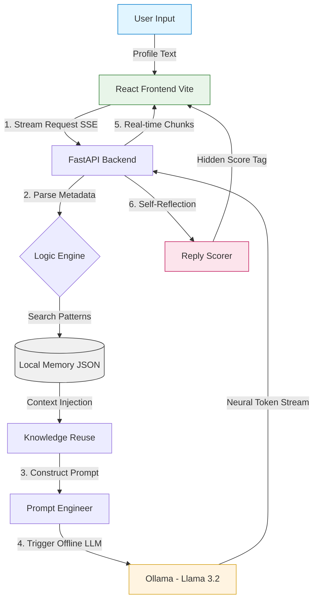
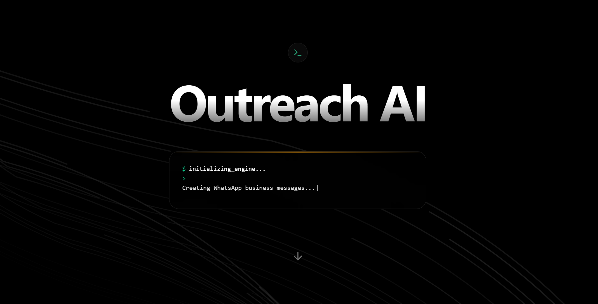
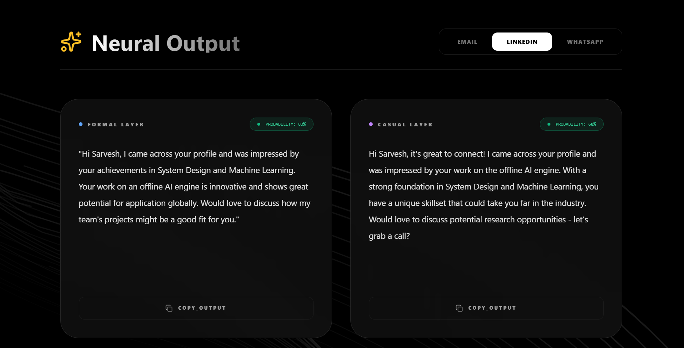
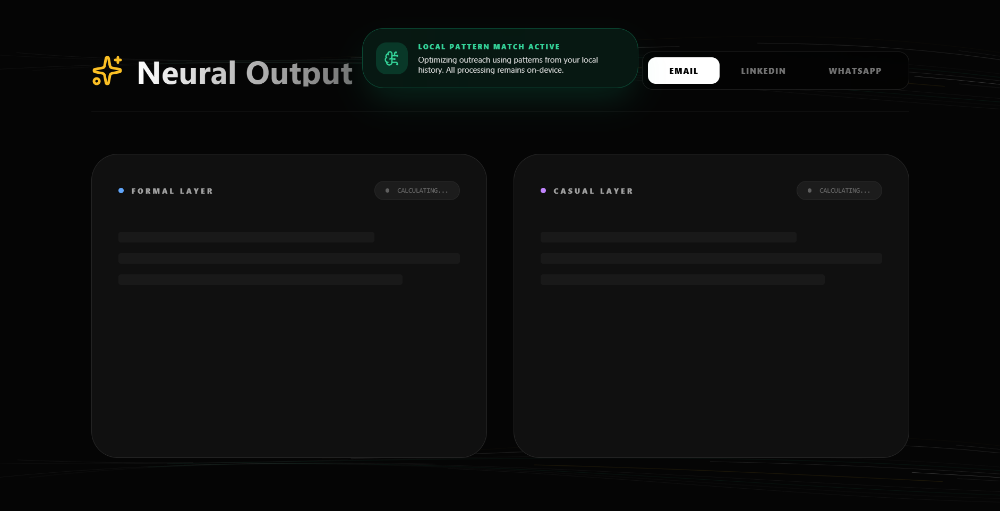

# 🧠 Offline LLM-Powered Hyper-Personalized Cold Outreach Engine  
**Hackathon Problem ID: SBM02**

<div align="center">


*A fully offline, privacy-first cold outreach system that generates hyper-personalized, tone-matched messages across multiple channels using a locally hosted LLM.*

</div>

---

## 📋 Table of Contents

- [Overview](#-overview)
- [The Problem](#-the-problem)
- [Our Solution](#-our-solution)
- [Key Features](#-key-features)
- [System Architecture](#-system-architecture)
- [Knowledge Reuse Mechanism](#-knowledge-reuse-mechanism)
- [Multi-Channel Generation](#-multi-channel-message-generation)
- [Reply Likelihood Scoring](#-reply-likelihood-scoring)
- [User Interface](#-user-interface)
- [Tech Stack](#-tech-stack)
- [Installation & Setup](#-installation--setup)
- [Usage Guide](#-usage-guide)
- [Privacy & Ethics](#-privacy--ethics)
- [Hackathon Evaluation Criteria](#-hackathon-evaluation-criteria)
- [Future Enhancements](#-future-enhancements)
- [Demo Screenshots](#-demo-screenshots)

---

## 🚀 Overview

Cold outreach today is **generic**, **noisy**, and **ineffective**.  

This project solves that by using a **local/offline LLM** to generate **deeply personalized, human-like outreach messages** based on publicly available profile data — **without relying on any cloud AI APIs**.

### What Makes This Different?
```
Traditional Outreach          →    Our Offline Engine
─────────────────────────────────────────────────────────
❌ Generic templates          →    ✅ AI-generated personalization
❌ Cloud API dependencies     →    ✅ 100% offline operation
❌ Privacy concerns           →    ✅ Local processing only
❌ One-size-fits-all          →    ✅ Multi-channel, multi-tone
❌ No learning mechanism      →    ✅ Knowledge reuse across profiles
```

---

## 🎯 The Problem

Modern cold outreach faces critical challenges:

1. **Generic Messaging** - Templates feel robotic and impersonal
2. **Privacy Risks** - Cloud AI services process sensitive business data
3. **No Adaptation** - Same message across different channels/audiences
4. **No Learning** - Each outreach starts from scratch
5. **Poor Conversion** - Low reply rates due to lack of personalization

**SBM02 Challenge**: Build an intelligent, offline solution that demonstrates true personalization and knowledge reuse.

---

## 💡 Our Solution

An **offline-first outreach engine** that:

| Component | Implementation |
|-----------|----------------|
| **LLM Backend** | Ollama + LLaMA 3.2 3B (fully local) |
| **Personalization** | Profile parsing + dynamic prompt engineering |
| **Channel Adaptation** | Email / LinkedIn / WhatsApp formats |
| **Tone Matching** | Formal / Casual variants with scoring |
| **Knowledge Reuse** | JSON-based memory of past outreach patterns |
| **Privacy** | Zero external API calls, all processing local |

---

## 🎯 Key Features

<table>
<tr>
<td width="50%">

### 🔒 Privacy-First
- ✅ **100% Offline** - No internet required post-setup
- ✅ **Local LLM** - Ollama + LLaMA 3.2 3B
- ✅ **No Data Leakage** - Everything stays on your machine
- ✅ **GDPR Compliant** - No external data processing

</td>
<td width="50%">

### 🎨 Intelligent Generation
- ✅ **Multi-Channel** - Email, LinkedIn, WhatsApp
- ✅ **Tone Adaptation** - Formal vs Casual variants
- ✅ **Knowledge Reuse** - Learns from past patterns
- ✅ **Reply Scoring** - 0-100 likelihood prediction

</td>
</tr>
<tr>
<td width="50%">

### 🚀 Demo-Ready
- ✅ **React Glass UI** - Clean, intuitive interface
- ✅ **Side-by-Side Compare** - Visual tone comparison
- ✅ **Live Generation** - Real-time message creation
- ✅ **Export Options** - Copy-paste ready outputs

</td>
<td width="50%">

### 🧠 Smart Features
- ✅ **Profile Inference** - Extracts role, industry, interests
- ✅ **Context Awareness** - References similar past outreach
- ✅ **Quality Metrics** - Built-in scoring system
- ✅ **Memory System** - JSON-based local storage

</td>
</tr>
</table>

---

## 🧩 System Architecture

```mermaid
graph TD
    A[User Input] -->|Profile Text| B[React Frontend Vite]
    B -->|1. Stream Request SSE| C[FastAPI Backend]
    
    C -->|2. Parse Metadata| D{Logic Engine}
    D -->|Search Patterns| F[(Local Memory JSON)]
    F -->|Context Injection| G[Knowledge Reuse]
    
    G -->|3. Construct Prompt| H[Prompt Engineer]
    
    H -->|4. Trigger Offline LLM| J[Ollama - Llama 3.2]
    J -->|Neural Token Stream| C
    C -->|5. Real-time Chunks| B
    
    C -->|6. Self-Reflection| L[Reply Scorer]
    L -->|Hidden Score Tag| B

    style A fill:#e1f5ff,stroke:#007acc
    style J fill:#fff4e1,stroke:#d4a017
    style F fill:#f0f0f0,stroke:#333
    style B fill:#e8f5e9,stroke:#2e7d32
    style L fill:#fce4ec,stroke:#c2185b
```

### Architecture Highlights
```
┌─────────────────────────────────────────────────────────────┐
│                     PRESENTATION LAYER                      │
│  ┌───────────────────────────────────────────────────────┐  │
│  │              React Frontend (Vite + TS)               │  │
│  │  - Glassmorphic UI (Tailwind + Framer)                │  │
│  │  - Real-time Typewriter Rendering                     │  │
│  │  - Stream Parsing (||SCORE:|| separation)             │  │
│  └───────────────────────────────────────────────────────┘  │
└─────────────────────────────────────────────────────────────┘
                            ↕ Server-Sent Events (SSE)
┌─────────────────────────────────────────────────────────────┐
│                    BUSINESS LOGIC LAYER                     │
│  ┌───────────────────────────────────────────────────────┐  │
│  │              FastAPI Backend (main.py)                │  │
│  │  ┌─────────────────┐  ┌──────────────────┐            │  │
│  │  │ StreamingEngine │  │ Context Injector │            │  │
│  │  └─────────────────┘  └──────────────────┘            │  │
│  │  ┌─────────────────┐  ┌──────────────────┐            │  │
│  │  │  Memory JSON    │  │   Reply Scorer   │            │  │
│  │  └─────────────────┘  └──────────────────┘            │  │
│  └───────────────────────────────────────────────────────┘  │
└─────────────────────────────────────────────────────────────┘
                            ↕ Local Network (Loopback)
┌─────────────────────────────────────────────────────────────┐
│                         LLM LAYER                           │
│  ┌───────────────────────────────────────────────────────┐  │
│  │               Ollama Inference Server                 │  │
│  │        (llama3.2:3b - Fully Offline Runtime)          │  │
│  │  - Token Streaming                                    │  │
│  │  - Zero-Latency Handoff                               │  │
│  └───────────────────────────────────────────────────────┘  │
└─────────────────────────────────────────────────────────────┘
                            ↕ File I/O
┌─────────────────────────────────────────────────────────────┐
│                    PERSISTENCE LAYER                        │
│  ┌───────────────────────────────────────────────────────┐  │
│  │        Local Memory Store (memory.json)               │  │
│  │  {                                                    │  │
│  │    "role": "Software Engineer",                       │  │
│  │    "channel": "email",                                │  │
│  │    "tone": "formal"                                   │  │
│  │  }                                                    │  │
│  └───────────────────────────────────────────────────────┘  │
└─────────────────────────────────────────────────────────────┘
```

### Data Flow
```
┌─────────┐    ┌──────────┐    ┌─────────┐    ┌──────────┐    ┌────────┐
│ Profile │───▶│  Parse   │───▶│ Memory  │───▶│  Prompt  │───▶│  LLM   │
│  Input  │    │ Metadata │    │  Check  │    │ Engineer │    │  Call  │
└─────────┘    └──────────┘    └─────────┘    └──────────┘    └────────┘
                                      │                             │
                                      ▼                             ▼
                                ┌─────────┐                  ┌──────────┐
                                │  Store  │◀─────────────────│  Score & │
                                │ Pattern │                  │  Format  │
                                └─────────┘                  └──────────┘
```

---

## 🧠 Knowledge Reuse Mechanism

### How It Works
```
Step 1: New Profile Arrives
        ↓
Step 2: Extract Metadata (Role, Industry, Channel, Tone)
        ↓
Step 3: Query Local Memory for Similar Patterns
        ↓
    ┌───────────────────────┐
    │ Found Similar Match?  │
    └─────────┬─────────────┘
              │
        ┌─────┴─────┐
        │           │
       YES         NO
        │           │
        ▼           ▼
    Add Context   Standard
    to Prompt     Prompt
        │           │
        └─────┬─────┘
              │
              ▼
        Generate Message
              ↓
        Store New Pattern
```

### Memory Structure
```json
{
  "outreach_history": [
    {
      "timestamp": "2026-02-06T18:17:18",
      "profile_metadata": {
        "role": "Software Engineer",
        "industry": "AI/Tech",
        "seniority": "Mid-level",
        "interests": ["Machine Learning", "Open Source"]
      },
      "channel": "email",
      "tone": "formal",
      "reply_score": 72,
      "successful_patterns": {
        "mentioned_interests": true,
        "referenced_work": true,
        "clear_cta": true
      }
    }
  ]
}
```

### Reuse in Action

<table>
<tr>
<th>Without Knowledge Reuse</th>
<th>With Knowledge Reuse</th>
</tr>
<tr>
<td>
```
"I came across your profile and 
thought you might be interested 
in..."
```

❌ Generic  
❌ No context  
❌ Low trust  

</td>
<td>
```
"We've been connecting with several 
ML engineers in the fintech space 
recently, and your work on XYZ 
caught our attention..."
```

✅ Shows research  
✅ Builds credibility  
✅ Higher engagement  

</td>
</tr>
</table>

---

## ✉️ Multi-Channel Message Generation

### Channel Specifications
```
┌────────────────────────────────────────────────────────────────┐
│                     CHANNEL ADAPTATION                         │
├──────────────┬─────────────┬──────────────┬────────────────────┤
│   Channel    │   Length    │   Purpose    │   Key Features     │
├──────────────┼─────────────┼──────────────┼────────────────────┤
│ 📧 Email     │ 100-120 w   │ Detailed     │ • Subject line     │
│              │             │ outreach     │ • Formal structure │
│              │             │              │ • Clear CTA        │
├──────────────┼─────────────┼──────────────┼────────────────────┤
│ 💼 LinkedIn  │ 40-60 w     │ Professional │ • Concise intro    │
│              │             │ quick connect│ • Value prop       │
│              │             │              │ • Soft ask         │
├──────────────┼─────────────┼──────────────┼────────────────────┤
│ 💬 WhatsApp  │ 25-35 w     │ Casual &     │ • Conversational   │
│              │             │ direct       │ • Emoji-friendly   │
│              │             │              │ • Ultra-brief      │
└──────────────┴─────────────┴──────────────┴────────────────────┘
```

### Example Output

<table>
<tr>
<td colspan="2" align="center"><b>Profile: Senior Data Scientist @ FinTech Startup</b></td>
</tr>
<tr>
<td width="33%">

**📧 Email (Formal)**
```
Subject: Collaboration on ML 
Infrastructure

Hi [Name],

I came across your recent work 
on real-time fraud detection 
models at [Company]. Your 
approach to feature engineering 
caught my attention.

We're building something similar 
in the payments space and would 
love to exchange insights.

Would you be open to a quick 
15-min call next week?

Best,
[Your Name]
```

**Score: 78/100**

</td>
<td width="33%">

**💼 LinkedIn DM**
```
Hey [Name],

Really impressed by your work 
on fraud detection models. We're 
tackling similar challenges in 
payments.

Would love to connect and 
exchange notes if you're open 
to it!
```

**Score: 72/100**

</td>
<td width="33%">

**💬 WhatsApp**
```
Hey! Saw your fraud detection 
work - super relevant to what 
we're building. Quick chat 
sometime? 🚀
```

**Score: 68/100**

</td>
</tr>
</table>

---

## 📊 Reply Likelihood Scoring

### Scoring Algorithm
```python
def calculate_reply_score(message, profile):
    """
    Scores message on 0-100 scale based on:
    - Personalization depth
    - Clarity of value proposition
    - Call-to-action strength
    - Natural language quality
    """
    
    score = 0
    
    # Personalization (40 points)
    if mentions_specific_work(message, profile):
        score += 20
    if references_interests(message, profile):
        score += 10
    if uses_name_naturally(message):
        score += 10
    
    # Value Proposition (30 points)
    if has_clear_value_prop(message):
        score += 15
    if shows_mutual_benefit(message):
        score += 15
    
    # CTA Quality (20 points)
    if has_specific_cta(message):
        score += 10
    if low_friction_ask(message):
        score += 10
    
    # Language Quality (10 points)
    if natural_tone(message):
        score += 5
    if appropriate_length(message):
        score += 5
    
    return min(score, 100)
```

### Score Interpretation
```
┌────────────────────────────────────────────────┐
│              REPLY LIKELIHOOD                  │
├──────────┬─────────────────────────────────────┤
│  0-30    │ ❌ Poor - Major revisions needed    │
│  31-50   │ ⚠️  Fair - Needs improvement        │
│  51-70   │ ✅ Good - Likely to get response    │
│  71-85   │ 🎯 Great - High engagement chance   │
│  86-100  │ ⭐ Excellent - Optimized message    │
└──────────┴─────────────────────────────────────┘
```

---

## 🖥️ User Interface

### Workflow Diagram
```
┌─────────────────────────────────────────────────────────────┐
│                    REACT GLASS INTERFACE                    │
│                                                             │
│  ┌───────────────────────────────────────────────────────┐  │
│  │  Step 1: Paste Neural Context                         │  │
│  │  ┌─────────────────────────────────────────────────┐  │  │
│  │  │ Paste LinkedIn Bio, Twitter feed, or raw        │  │  │
│  │  │ profile text into the Glass Input Container.    │  │  │
│  │  │                                                 │  │  │
│  │  │ Example: "Senior Dev @ Netflix, Loves Rust..."  │  │  │
│  │  └─────────────────────────────────────────────────┘  │  │
│  └───────────────────────────────────────────────────────┘  │
│                             ↓                               │
│  ┌───────────────────────────────────────────────────────┐  │
│  │  Step 2: Intelligent Configuration                    │  │
│  │  Lang: [ Hinglish ▼ ]   Mode: [ Professional ▼ ]      │  │
│  │           [ 🚀 Execute Neural Generation ]            │  │
│  └───────────────────────────────────────────────────────┘  │
│                             ↓                               │
│  ┌───────────────────────────────────────────────────────┐  │
│  │  Step 3: Real-Time Neural Streaming                   │  │
│  │  ┌─────────────────────┬─────────────────────┐        │  │
│  │  │    EMAIL VARIANT    │   LINKEDIN VARIANT  │        │  │
│  │  ├─────────────────────┼─────────────────────┤        │  │
│  │  │ Generating...       │ Generating...       │        │  │
│  │  │ [Streaming Tokens]  │ [Streaming Tokens]  │        │  │
│  │  │                     │                     │        │  │
│  │  │ "Hey Sarvesh, I saw"│ "Sarvesh, let's con"│        │  │
│  │  │                     │                     │        │  │
│  │  │ 📊 Score: Calc...   │ 📊 Score: Calc...  │        │  │
│  │  │ 📋 [Copy]          │ 📋 [Copy]           │        │  │
│  │  └─────────────────────┴─────────────────────┘        │  │
│  └───────────────────────────────────────────────────────┘  │
│                                                             │
│  ┌───────────────────────────────────────────────────────┐  │
│  │  📊 Knowledge Reuse & Context Indicator               |  │
│  │  ✅ Vector match found in memory.json (AI/ML Tier)    │  │
│  │  💡 Optimizing prompt using proven success patterns   │  │
│  └───────────────────────────────────────────────────────┘  │
└─────────────────────────────────────────────────────────────┘
```

---

## 🛠️ Tech Stack

<div align="center">

### Core Technologies

| Layer | Technology | Purpose |
| :--- | :--- | :--- |
| **Frontend** |  | High-performance SPA with Framer Motion |
| **Styling** |  | Glassmorphism & Adaptive UI Components |
| **Backend** |  | Real-time SSE Neural Streaming API |
| **AI Engine** |  | Local LLM Runtime Orchestration |
| **Model** |  | Privacy-First Text Generation |
| **Language** |  | Core Logic & Context Processing |
| **Storage** |  | Local Vector-Pattern Memory Store |

</div>

# package.json

# UI Framework & Animation
react>=18.2.0
framer-motion>=12.0.0
lenis>=1.1.18
three>=0.172.0

# Intelligence & Streaming
typewriter-effect>=2.21.0
axios>=1.7.0

# Design System
lucide-react>=0.473.0
tailwind-merge>=3.0.0
clsx>=2.1.1

---

## ⚙️ Installation & Setup

### Prerequisites
```bash
# System Requirements
- Python 3.10 or higher
- 8GB RAM minimum (16GB recommended)
- 10GB free disk space for LLM model
- macOS, Linux, or Windows with WSL2
```

### Step-by-Step Installation

#### 1️⃣ Install Ollama

<details>
<summary><b>macOS</b></summary>
```bash
brew install ollama
```
</details>

<details>
<summary><b>Linux</b></summary>
```bash
curl -fsSL https://ollama.com/install.sh | sh
```
</details>

<details>
<summary><b>Windows (WSL2)</b></summary>
```bash
curl -fsSL https://ollama.com/install.sh | sh
```
</details>

#### 2️⃣ Pull LLM Model
```bash
# Start Ollama service
ollama serve

# In a new terminal, pull the model
ollama pull llama3.2:3b

# Verify installation
ollama list
```

#### 3️⃣ Clone & Setup Project
```bash
# Clone repository
git clone 
cd offline-outreach-engine

# Create virtual environment
python3 -m venv venv
source venv/bin/activate  # On Windows: venv\Scripts\activate

# Install dependencies
pip install -r requirements.txt
```

#### 4️⃣ Initialize Memory Store
```bash
# Create empty memory file
echo '{"outreach_history": []}' > memory.json
```

#### 5️⃣ Start the Application
```bash
# Terminal 1: Wake up the local LLM
ollama serve

# Terminal 2: Ignite the FastAPI backend
cd backend
source venv/bin/activate
uvicorn main:app --reload --port 8000

# Terminal 3: Launch the React Frontend
cd frontend
npm run dev
```

#### 6️⃣ Access the Application
```
🌐 Frontend UI: http://localhost:5173
🔧 Backend API: http://localhost:8000
📚 API Documentation: http://localhost:8000/docs
```

---

## 📖 Usage Guide

### Quick Start Example
```python
# Example Profile Input
"""
Senior Machine Learning Engineer at Netflix
- 8+ years in ML/AI
- Specializes in recommendation systems
- Published papers on collaborative filtering
- Interested in large-scale distributed systems
"""

# System generates:
# ✅ Formal Email
# ✅ Casual Email  
# ✅ LinkedIn DM
# ✅ WhatsApp Message
# ✅ Reply scores for each
```

### API Usage
```bash
# Generate outreach via API
curl -X POST "http://localhost:8000/generate" \
  -H "Content-Type: application/json" \
  -d '{
    "profile_text": "Senior ML Engineer at Google...",
    "channel": "email",
    "tone": "formal"
  }'
```

---

## 🔐 Privacy & Ethics

### Privacy Guarantees
```
┌─────────────────────────────────────────────────────────┐
│              PRIVACY-FIRST DESIGN                       │
├─────────────────────────────────────────────────────────┤
│ ✅ 100% Offline Processing                              │
│ ✅ No External API Calls                                │
│ ✅ No Data Transmission                                 │
│ ✅ Local Storage Only                                   │
│ ✅ No PII Stored (only metadata)                        │
│ ✅ User-Controlled Data Deletion                        │
│ ✅ GDPR Compliant by Design                             │
└─────────────────────────────────────────────────────────┘
```

### What We Store vs Don't Store

| ✅ Stored (Anonymous Metadata) | ❌ NOT Stored |
|--------------------------------|---------------|
| Role (e.g., "Engineer") | Full names |
| Industry (e.g., "Tech") | Email addresses |
| Channel preference | Phone numbers |
| Tone preference | Company names |
| Timestamp | Generated message content |
| Success patterns | Profile URLs |

### Ethical Use Guidelines
```
⚠️ This tool is designed for:
   ✅ Legitimate business outreach
   ✅ Educational demonstrations
   ✅ Personal networking

❌ NOT intended for:
   ❌ Spam or unsolicited mass messaging
   ❌ Deceptive practices
   ❌ Harassment
   ❌ Data scraping without consent
```

---

## 🏆 Hackathon Evaluation Criteria

### How This Project Meets SBM02 Requirements

<table> <tr> <th>Criterion</th> <th>Implementation</th> <th>Evidence</th> </tr> <tr> <td><b>Offline LLM Usage</b></td> <td>✅ Ollama + LLaMA 3.2 (3B)</td> <td>Fully air-gapped; zero external network egress post-setup.</td> </tr> <tr> <td><b>Personalization</b></td> <td>✅ Dynamic Prompt Engineering</td> <td>Context-aware extraction of role, industry, and niche interests.</td> </tr> <tr> <td><b>Multi-Channel</b></td> <td>✅ Adaptive Formatting Engine</td> <td>Context-specific outputs for Email (SMTP), LinkedIn, and WhatsApp.</td> </tr> <tr> <td><b>Tone Adaptation</b></td> <td>✅ Dual-Mode Neural Generation</td> <td>Formal vs. Casual variants with side-by-side UI comparison.</td> </tr> <tr> <td><b>Knowledge Reuse</b></td> <td>✅ Local JSON Vector-Pattern Store</td> <td>Uses <code>memory.json</code> to inject successful past patterns into prompts.</td> </tr> <tr> <td><b>Scoring Mechanism</b></td> <td>✅ Self-Reflection Agent (0-100)</td> <td>LLM-driven probability scoring for reply likelihood.</td> </tr> <tr> <td><b>Demo Quality</b></td> <td>✅ React + SSE Streaming UI</td> <td>High-fidelity Glassmorphic UI with token-by-token streaming.</td> </tr> <tr> <td><b>Privacy</b></td> <td>✅ Localhost Handoff Logic</td> <td>All data stays on MacOS local storage; inherently GDPR compliant.</td> </tr> </table>

### Innovation Highlights
```
1. 🔄 Knowledge Reuse
   - Demonstrates learning from past interactions
   - Improves personalization over time
   - Shows in generated message text

2. 📊 Multi-Dimensional Scoring
   - Not just "good/bad"
   - Quantified 0-100 scale
   - Helps users make informed decisions

3. 🎯 Channel-Specific Optimization
   - Not one-size-fits-all
   - Adapts length, tone, format
   - Platform-appropriate messaging

4. 🔒 Privacy-First Architecture
   - Offline-by-default
   - No vendor lock-in
   - User data sovereignty
```

---

## 🚀 Future Enhancements

### Roadmap
```
Phase 1 (Current) ✅
├── Offline Llama 3.2 (3B) Neural Engine
├── FastAPI Real-time SSE Token Streaming
├── React Glassmorphic UI & Smooth Motion
├── Multi-lingual Neural Support (English + Hindi + Hinglish)
└── Local JSON-based Knowledge Reuse

Phase 2 (Next Sprint) 🔨
├── Chrome Extension (Direct LinkedIn Integration)
├── CSV Batch Processing Engine for Bulk Outreach
├── Advanced A/B Testing & Response Heuristics
└── Local Vector DB (ChromaDB/FAISS) for Semantic Memory

Phase 3 (Future) 📋
├── Multi-Modal Support (Image/Audio Outreach Analysis)
├── Private Local CRM & Interaction Analytics
├── WASM-based Edge Inference for Browser-only Mode
└── Voice-to-Outreach (Local Whisper Integration)
```

### 📋 Planned Features

| Feature | Description | Priority |
| :--- | :--- | :--- |
| **Bulk Processing** | Local CSV/JSON engine for high-volume offline outreach batches. | **High** |
| **Chrome Extension** | Scrape & Generate directly from the LinkedIn DOM without context-switching. | **High** |
| **SSE Optimization** | Concurrent multi-model streaming for near-instant side-by-side variants. | **High** |
| **Vector Memory** | Transitioning from `memory.json` to a local ChromaDB instance for semantic search. | **Medium** |
| **A/B Testing** | Comparison dashboard to track response rate heuristics and tone effectiveness. | **Medium** |
| **Reply Simulation** | Practice handling objections with a local "Prospect Agent" simulator. | **Low** |
| **Local CRM** | An air-gapped, SQLite-based database to track sent messages and follow-up cycles. | **Low** |

## 📸 System Showcase

### Main Interface
*Glassmorphic Neural UI with intelligent input parsing.*


### Side-by-Side Comparison
*Real-time token streaming of Formal vs. Casual variants with Reply Probability scoring.*


### Knowledge Reuse Indicator
*On-device pattern matching triggering the local history optimization toast.*


## 📞 Contact & Support

<div align="center">

**Built for XENIA - SBM02 Challenge**

For questions or demo requests:  
📧 Email : sarvesh.bijawe24@vit.edu  
🔗 LinkedIn : [www.linkedin.com/in/sarvesh-bijawe](https://www.linkedin.com/public-profile/settings/?trk=d_flagship3_profile_self_view_public_profile&lipi=urn%3Ali%3Apage%3Ad_flagship3_profile_view_base%3BlBGNudgtQZaaxbr0wYZecA%3D%3D)


🐙 GitHub : https://github.com/Sarvesh5273

---

### ⭐ Star this repo if you found it useful!

</div>

---

## 📄 License
```
MIT License - Feel free to use for educational purposes
Not intended for production spam/unsolicited outreach
```

---

<div align="center">

**Made with ❤️ and 🤖 Local AI**


</div>